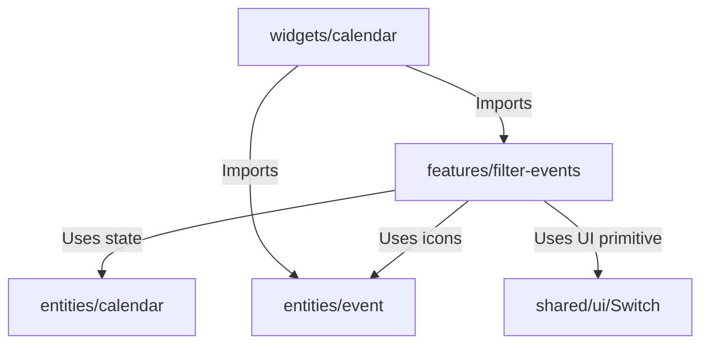

# Event Type Filter Implementation Plan

This document outlines a detailed step-by-step plan for implementing the event type filter dropdown in the calendar header.

---

## 🛠 Tech Stack & Libraries
- **State Management:** Redux Toolkit (extending the `ui` slice in `entities/calendar`).
- **Dropdown/Popover Component:** `@radix-ui/react-popover` (for flexible layout of interactive elements).
- **Toggle/Switch Component:** `@radix-ui/react-switch` (accessible switch primitive).
- **Icons:** `lucide-react`.
- **Styling:** CSS Modules.

---

## 📐 Architecture Design (FSD)
The filter will be implemented in the **features** layer and integrated into the calendar widget.



---

## 📝 Step-by-Step Implementation Plan

### Step 1: Prepare Constants & Icons (`entities/event`)
Since widgets and features cannot import from each other in FSD, we will move the icon mapping to the entities layer.
1. Create `src/entities/event/config/activityTypes.ts`.
2. Move the `typeIcons` mapping from [EventsTooltipContent.tsx](file:///Users/deniskalinin/frontend/guild-master/src/widgets/calendar/ui/EventsTooltipContent.tsx) to this new file, and define an array of all event types:
   ```typescript
   import { ActivityType } from '@/shared/types';
   export const ACTIVITY_TYPES: ActivityType[] = ['raid', 'game', 'meeting', 'dungeon', 'party', 'sport', 'dnd', 'boardgame', 'other'];
   ```
3. Export them from `src/entities/event/index.ts`.
4. Update imports in [EventsTooltipContent.tsx](file:///Users/deniskalinin/frontend/guild-master/src/widgets/calendar/ui/EventsTooltipContent.tsx) and [CalendarGrid.tsx](file:///Users/deniskalinin/frontend/guild-master/src/widgets/calendar/ui/CalendarGrid.tsx).

### Step 2: Install Dependencies
Install the required Radix UI primitives:
```bash
npm install @radix-ui/react-popover @radix-ui/react-switch
```

### Step 3: Add Localization Keys
Add new translation strings to [ru.json](file:///Users/deniskalinin/frontend/guild-master/messages/ru.json) and [en.json](file:///Users/deniskalinin/frontend/guild-master/messages/en.json) under the `"Event"` section:
```json
"filter": {
  "all": "All",
  "enableAll": "Enable all",
  "disableAll": "Disable all",
  "triggerLabel": "Filter events by type",
  "ariaLabel": "Event type filter"
}
```
*(Make sure to translate the values appropriately in the Russian file).*

### Step 4: Extend Redux Store State (`entities/calendar`)
1. Update `UIState` interface in `src/shared/types/index.ts` by adding `excludedEventTypes: ActivityType[]`.
2. In [slice.ts](file:///Users/deniskalinin/frontend/guild-master/src/entities/calendar/model/slice.ts):
   - Initialize `excludedEventTypes: []` in `initialState`.
   - Add a reducer `toggleEventType(state, action: PayloadAction<ActivityType>)` to toggle type exclusion.
   - Add a reducer `setAllEventTypesEnabled(state, action: PayloadAction<boolean>)` to enable or disable all event types at once.
3. Export these new actions in `src/entities/calendar/index.ts`.

### Step 5: Create Reusable Switch Component (`shared/ui`)
Create a reusable switch component:
1. Create `src/shared/ui/Switch` directory.
2. Implement `Switch.tsx` using `@radix-ui/react-switch`.
3. Style it in `Switch.module.css` using theme variables (glass background, slide animations, accent colors).
4. Export it via `index.ts`.

### Step 6: Implement Filter Feature Component (`features/filter-events`)
1. Create `src/features/filter-events/` directory.
2. Implement `EventFilterDropdown.tsx` in `ui/`:
   - Use `@radix-ui/react-popover`.
   - **Trigger:**
     - If `excludedEventTypes.length === 0`, show "All" text.
     - Otherwise, show a row of icons representing the disabled event types (with `opacity: 0.5` or a muted gray color).
     - Limit the displayed disabled icons to 3. If there are more, display a `+N` counter.
   - **Popover Content:**
     - Header with "Enable all" and "Disable all" buttons.
     - List of event types, where each item contains:
       1. The event type color/icon.
       2. The localized name of the event type (from `Common.eventTypes`).
       3. The `Switch` component controlling the toggled state.
3. Write styles in `EventFilterDropdown.module.css`.
4. Export the component via `src/features/filter-events/index.ts`.

### Step 7: Integrate Filter in Calendar Grid (`widgets/calendar`)
1. In [CalendarGrid.tsx](file:///Users/deniskalinin/frontend/guild-master/src/widgets/calendar/ui/CalendarGrid.tsx):
   - Import `<EventFilterDropdown />` and render it in `.controlsLeft` (e.g. next to the guild selection dropdown).
   - Retrieve `excludedEventTypes` from the Redux store.
   - Apply the filter to the event list before rendering:
     ```typescript
     const dayEvents = events
       .filter(event => event.date === day.fullDate && !excludedEventTypes.includes(event.type))
       .sort((a, b) => a.time.localeCompare(b.time));
     ```

### Step 8: Write Tests
1. Write unit tests for the new Redux reducers in `src/entities/calendar/model/slice.test.ts`.
2. Add a basic rendering and interaction test for the `EventFilterDropdown` component.
